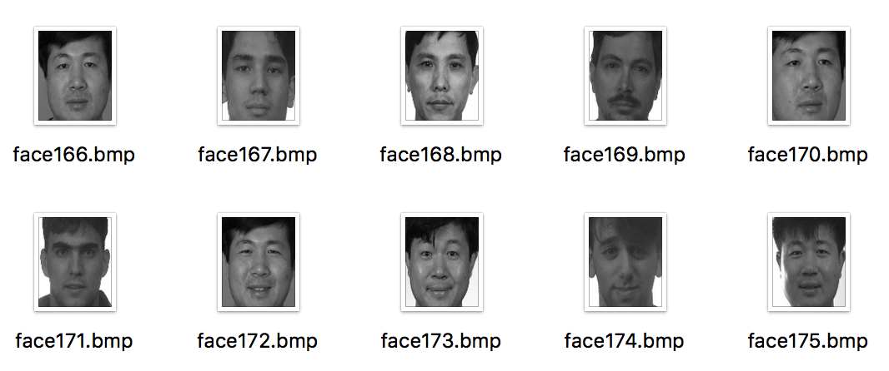
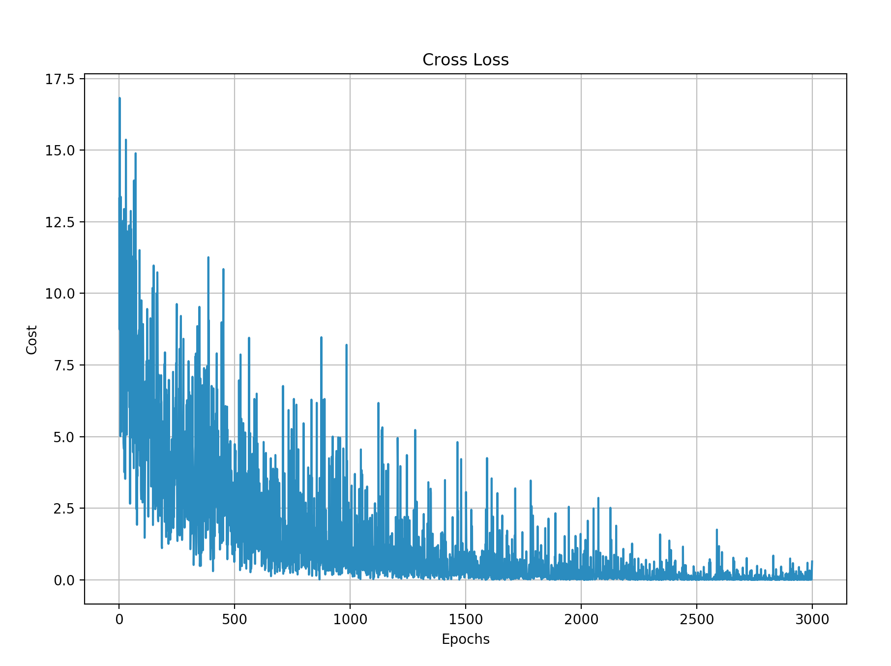
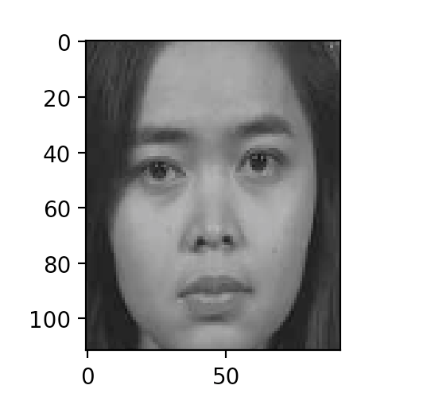

本文主要是实现了根据人脸识别性别的卷积神经网络,并对卷积过程中的提取特征进行了可视化. 

[代码来源](https://github.com/chenlinzhong/gender-recognition.git):https://github.com/chenlinzhong/gender-recognition.git    
在此基础上进行了部分修改   
  
  

--


### 卷积神经网络

  * 卷积神经网络最早是为了解决图像识别的问题,现在也用在时间序列数据和文本数据处理当中,卷积神经网络对于数据特征的提取不用额外进行,在对网络的训练的过程当中,网络会自动提取主要的特征. 
  * 卷积神经网络直接用原始图像的全部像素作为输入,但是内部为非全连接结构.因为图像数据在空间上是有组织结构的,每一个像素在空间上和周围的像素是有关系的,和相距很远的像素基本上是没什么联系的,每个神经元只需要接受局部的像素作为输入,再将局部信息汇总就能得到全局信息. 权值共享和池化两个操作使网络模型的参数大幅的减少,提高了模型的训练效率.

### 卷积神经网络主要特点

* 权值共享: 在卷积层中可以有多个卷积核,每个卷积核与原始图像进行卷积运算后会映射出一个新的2D图像,新图像的每个像素都来自同一个卷积核.这就是权值共享. 
* 池化: 降采样,对卷积(滤波)后,经过激活函数处理后的图像,保留像素块中灰度值最高的像素点(保留最主要的特征),比如进行 2X2的最大池化,把一个2x2的像素块降为1x1的像素块.

### 卷积网络的训练数据（112\*92\*3图形）

从data目录读取数据，famale存放女性图片，male存放男性图片

```
def read_img(list,flag=0):
    for i in range(len(list)-1):
         if os.path.isfile(list[i]):
             images.append(cv2.imread(list[i]).flatten())
             labels.append(flag)

read_img(get_img_list('male'),[0,1])
read_img(get_img_list('female'),[1,0])

images = np.array(images)
labels = np.array(labels)
```

重新打乱

```
permutation = np.random.permutation(labels.shape[0])
all_images = images[permutation,:]
all_labels = labels[permutation,:]
```

训练集与测试集比例 8：2

```
train_total = all_images.shape[0]
train_nums= int(all_images.shape[0]*0.8)
test_nums = all_images.shape[0]-train_nums

#训练集
images = all_images[0:train_nums,:]
labels = all_labels[0:train_nums,:]

#测试集
test_images = all_images[train_nums:train_total,:]
test_labels = all_labels[train_nums:train_total,:]
```

### 训练参数

```
train_epochs=3000                # 训练轮数
batch_size= random.randint(6,18) # 每次训练数据,随机
drop_prob = 0.4                  # 正则化,丢弃比例
learning_rate=0.00001            # 学习效率
```

### 网络结构


```
输入层为输入的灰度图像尺寸:  -1 x 112 x 92 x 3 
第一个卷积层,卷积核的大小,深度和数量 (3, 3, 3, 16)
池化后的特征张量尺寸:       -1 x 56 x 46 x 16
第二个卷积层,卷积核的大小,深度和数量 (3, 3, 16, 32)
池化后的特征张量尺寸:       -1 x 28 x 23 x 32
第三个卷积层,卷积核的大小,深度和数量 (3, 3, 32, 64)
池化后的特征张量尺寸:       -1 x 14 x 12 x 64
全连接第一层权重矩阵:         10752 x 512
全连接第二层权重矩阵:         512 x 128
输出层与全连接隐藏层之间:     128 x 2
```

### 辅助函数
```
# 权重初始化(卷积核初始化)
# tf.truncated_normal()不同于tf.random_normal(),返回的值中不会偏离均值两倍的标准差
# 参数shpae为一个列表对象,例如[5, 5, 1, 32]对应
# 5,5 表示卷积核的大小, 1代表通道channel,对彩色图片做卷积是3,单色灰度为1
# 最后一个数字32,卷积核的个数,(也就是卷基层提取的特征数量)

def weight_init(shape):
    weight = tf.truncated_normal(shape,stddev=0.1,dtype=tf.float32)
    return tf.Variable(weight)

#偏执初始化
def bias_init(shape):
    bias = tf.random_normal(shape,dtype=tf.float32)
    return tf.Variable(bias)

#全连接矩阵初始化
def fch_init(layer1,layer2,const=1):
    min = -const * (6.0 / (layer1 + layer2));
    max = -min;
    weight = tf.random_uniform([layer1, layer2], minval=min, maxval=max, dtype=tf.float32)
    return tf.Variable(weight)
    
# 源码的位置在tensorflow/python/ops下nn_impl.py和nn_ops.py
# 这个函数接收两个参数,x 是图像的像素, w 是卷积核
# x 张量的维度[batch, height, width, channels]
# w 卷积核的维度[height, width, channels, channels_multiplier]
# tf.nn.conv2d()是一个二维卷积函数,
# stirdes 是卷积核移动的步长,4个1表示,在x张量维度的四个参数上移动步长
# padding 参数'SAME',表示对原始输入像素进行填充,卷积后映射的2D图像与原图大小相等
# 填充,是指在原图像素值矩阵周围填充0像素点
# 如果不进行填充,假设 原图为 32x32 的图像,卷积和大小为 5x5 ,卷积后映射图像大小 为 28x28
def conv2d(images,weight):
    return tf.nn.conv2d(images,weight,strides=[1,1,1,1],padding='SAME')


    
```

Padding

```
#池化
卷积核在提取特征时的动作成为padding，它有两种方式：SAME和VALID。卷积核的移动步长不一定能够整除图片像素的宽度，所以在有些图片的边框位置有些像素不能被卷积。这种不越过边缘的取样就叫做 valid padding，卷积后的图像面积小于原图像。为了让卷积核覆盖到所有的像素，可以对边缘位置进行0像素填充，然后在进行卷积。这种越过边缘的取样是 same padding。如过移动步长为1，那么得到和原图一样大小的图像。如果步长很大，超过了卷积核长度，那么same padding，得到的特征图也会小于原来的图像。
def max_pool2x2(images,tname):
    return tf.nn.max_pool(images,ksize=[1,2,2,1],strides=[1,2,2,1],padding='SAME',name=tname)


```

```
#images_input 为输入的图片，labels_input为输入的标签
images_input = tf.placeholder(tf.float32,[None,112*92*3],name='input_images')
labels_input = tf.placeholder(tf.float32,[None,2],name='input_labels')
#把图像转换为112*92*3的形状
x_input = tf.reshape(images_input,[-1,112,92,3])

```

### 训练

第一层卷积+池化
```
# 卷积核3*3*3 16个     第一层卷积
w1 = weight_init([3,3,3,16])
b1 = bias_init([16])
conv_1 = conv2d(x_input,w1)+b1
relu_1 = tf.nn.relu(conv_1,name='relu_1')
max_pool_1 = max_pool2x2(relu_1,'max_pool_1')
```

第二层卷积+池化
```
# 卷积核3*3*16  32个  第二层卷积
w2 = weight_init([3,3,16,32])
b2 = bias_init([32])
conv_2 = conv2d(max_pool_1,w2) + b2
relu_2 = tf.nn.relu(conv_2,name='relu_2')
max_pool_2 = max_pool2x2(relu_2,'max_pool_2')
```

第三层卷积+池化
```
w3 = weight_init([3,3,32,64])
b3 = bias_init([64])
conv_3 = conv2d(max_pool_2,w3)+b3
relu_3 = tf.nn.relu(conv_3,name='relu_3')
max_pool_3 = max_pool2x2(relu_3,'max_pool_3')
```

全连接第一层
```
#把第三层的卷积结果平铺成一维向量
f_input = tf.reshape(max_pool_3,[-1,14*12*64])

#全连接第一层 31*31*32,512
f_w1= fch_init(14*12*64,512)
f_b1 = bias_init([512])
f_r1 = tf.matmul(f_input,f_w1) + f_b1

#激活函数，relu随机丢掉一些权重提供泛华能力
f_relu_r1 = tf.nn.relu(f_r1)

# 为了防止网络出现过拟合的情况,对全连接隐藏层进行 Dropout(正则化)处理,在训练过程中随机的丢弃部分
# 节点的数据来防止过拟合.Dropout同把节点数据设置为0来丢弃一些特征值,仅在训练过程中,
# 预测的时候,仍使用全数据特征
# 传入丢弃节点数据的比例
f_dropout_r1 = tf.nn.dropout(f_relu_r1,drop_prob)
```

全连接第二层
```
f_w2 = fch_init(512,128)
f_b2 = bias_init([128])
f_r2 = tf.matmul(f_dropout_r1,f_w2) + f_b2
f_relu_r2 = tf.nn.relu(f_r2)
f_dropout_r2 = tf.nn.dropout(f_relu_r2,drop_prob)
```

全连接输出层
```
f_w3 = fch_init(128,2)
f_b3 = bias_init([2])
f_r3 = tf.matmul(f_dropout_r2,f_w3) + f_b3
最后输出结果，可能是这样的[[0.0001,0.99999] ，那个位置的结果大就属于哪个分类
f_softmax = tf.nn.softmax(f_r3,name='f_softmax')
```

损失函数
```
#交叉熵代价函数
cross_entry =  tf.reduce_mean(tf.reduce_sum(-labels_input*tf.log(f_softmax)))
#优化器，自动执行梯度下降算法
optimizer  = tf.train.AdamOptimizer(learning_rate).minimize(cross_entry)
```

计算准确率&损失

```
arg1 = tf.argmax(labels_input,1)
arg2 = tf.argmax(f_softmax,1)
#每个样本的预测结果是一个(1,2)的vector
cos = tf.equal(arg1,arg2)
# tf.cast把bool值转换为浮点数
acc = tf.reduce_mean(tf.cast(cos,dtype=tf.float32))

```

启动会话开始训练
```
init = tf.global_variables_initializer()
sess = tf.Session()
sess.run(init)
Cost = []
Accuracy=[]
for i in range(train_epochs):
    idx=random.randint(0,len(train_data.images)-20)
    batch= random.randint(6,18)
    train_input = train_data.images[idx:(idx+batch)]
    train_labels = train_data.labels[idx:(idx+batch)]
    result,acc1,cross_entry_r,cos1,f_softmax1,relu_1_r= sess.run([optimizer,acc,cross_entry,cos,f_softmax,relu_1],feed_dict={images_input:train_input,labels_input:train_labels})
    print acc1
    Cost.append(cross_entry_r)
    Accuracy.append(acc1)

# 代价函数曲线
fig1,ax1 = plt.subplots(figsize=(10,7))
plt.plot(Cost)
ax1.set_xlabel('Epochs')
ax1.set_ylabel('Cost')
plt.title('Cross Loss')
plt.grid()
plt.show()

# 准确率曲线
fig7,ax7 = plt.subplots(figsize=(10,7))
plt.plot(Accuracy)
ax7.set_xlabel('Epochs')
ax7.set_ylabel('Accuracy Rate')
plt.title('Train Accuracy Rate')
plt.grid()
plt.show()

```

测试集验证

```
#测试
arg2_r = sess.run(arg2,feed_dict={images_input:train_data.test_images,labels_input:train_data.test_labels})
arg1_r = sess.run(arg1,feed_dict={images_input:train_data.test_images,labels_input:train_data.test_labels})
#使用混淆矩阵，打印报告
print (classification_report(arg1_r, arg2_r))
```

验证通过，保存模型
```
#保存模型
saver = tf.train.Saver()
saver.save(sess, './model/my-gender-v1.0')
```

使用已训练好的模型参考：gender_model_use.py

结果: 迭代3000次，模型的准确率达到93%


训练交叉熵代价



训练的准确率


训练数据中的一个样本 


第一层卷积提取的特征


2x2池化后特征


第二层卷积提取的特征


2x2池化后特征


第三层卷积提取的特征


2x2池化后特征


### 参考
https://blog.csdn.net/u014281392/article/details/74316028

